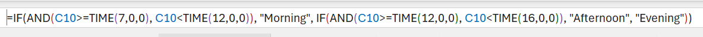
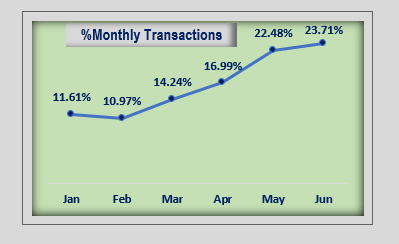
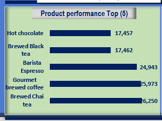
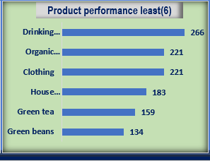
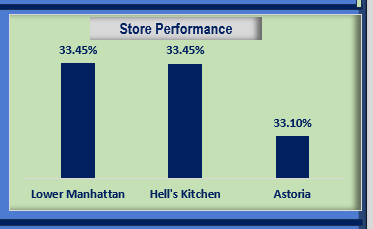
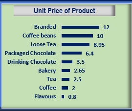
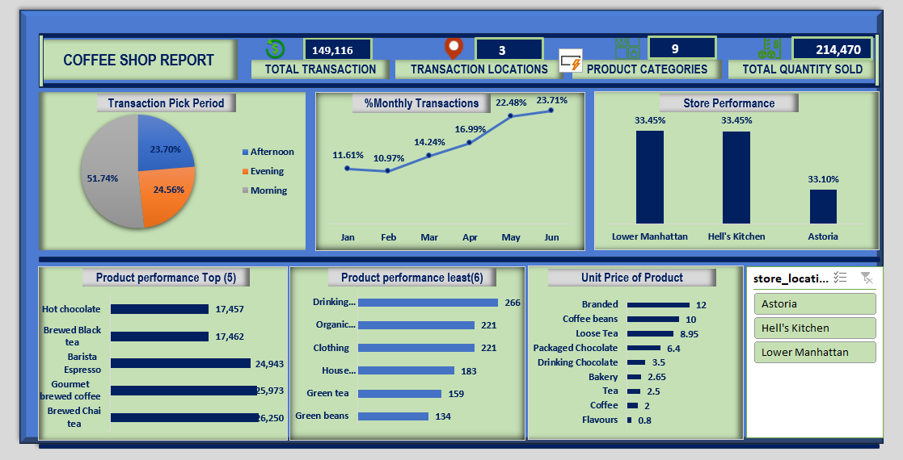

# Coffee Shop Analysis

## Tools Used: Microsoft Excel

## Introduction  
This dataset deals with transaction information related to product performance. It includes the following, product details, location details, purchase details and Transaction time.  Analysing and visualizing this dataset will provide valuable insights into product and Store location performance. 

## Problem Statement
I want to determine the product performance and identify the key factors influencing the product behaviour and propose actionable recommendation to enhance the product performance.

## Project Scope
1. Transaction Pick Periods:
- Investigate consumer behaviours during different times of the day: morning, afternoon, and evening. Analyse percentage transaction volume, and popular products during each period.

2. Percentage Monthly Performance:

-	Calculate the percentage change in transactions within the month in view. Identify the time of the day when the business thrives.
3.	Product Performance:

-	Top 5 Products: Determine the best-selling products based on transaction count. Understand why these products perform well.
-	Least 6 Products: Examine the least popular products. Identify potential reasons for their lower performance.

4.	Store Location Performance:

-	Compare the performance of different store locations. Assess metrics such as total quantity sold. Identify high-performing and underperforming stores.

5.	Product Unit Price Analysis:

   

-	Investigate the relationship between product unit prices and sales. Determine if higher or lower prices impact transaction volume. Consider if rice adjustment can make a difference.

## Dashboard

##Recommendations:
1.	Pick Period Transaction Analysis:
-	The data shows the distribution of transactions across different day periods.
-	Morning has the highest share of transactions at 51.74%, followed by Evening at 24.56%, and Afternoon at 23.70%.
-	This shows that much transaction is done in the morning time. And much priority should be given to the morning hours.
  
2.	Percentage of Monthly Transactions:
-	This analysis focuses on the distribution of transactions across different months.
-	June has the highest percentage of transactions at 23.71%, followed by May at 22.48%, and April at 16.99%.
-	January and February have relatively lower transaction percentages.
-	This shows that the business is making progress as the by year progresses.
  
3.	Top 5 Products (High Transaction Quantity):
-	The following products have good patronage: 
 i.	Brewed Chai Tea, Gourmet Brewed Coffee, Barista Espresso, Brewed Black Tea, and Hot Chocolate.
- ii.	Given their popularity, consider maintaining consistent stock levels for these items.
- iii.	Promote them prominently in your store or online platforms.
- iv.	Explore bundling deals or loyalty rewards to further boost sales.

4.	Least 6 Products (Low Transaction Quantity):
-	These products have significantly lower transaction quantities: 
1.	Green Beans, Green Tea, House Blend Beans, Clothing, Organic Chocolate, and Drinking Chocolate. The following should be considered.
- i.	More investigations like sampling customers opinions or taking questionnaires concerning the least performing products could help. 
- ii.	Pricing: From the analysis its obvious that not all the low performing product has high price tag.
- iii.	Promo: Consider running a healthy promo on the some of the low performing product to increase their market awareness and visibility.

5.	Location Performance:
- The three locations are doing very well for now, however, there is need to for continues improvement.

