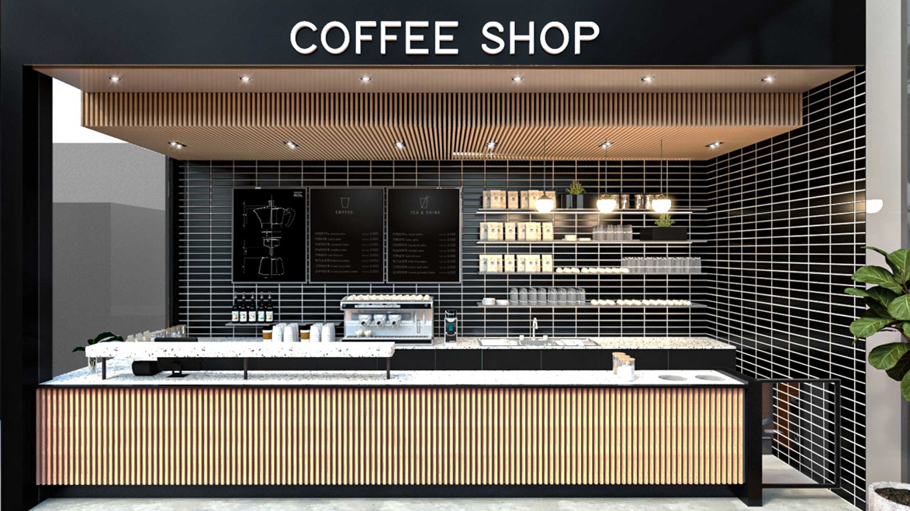
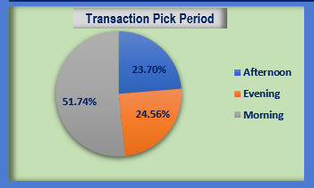

# Coffee Shop Analysis

***
## Tools Used: Microsoft Excel

***
## Introduction  
This dataset deals with transaction information related to product performance. It includes the following, product details, location details, purchase details and Transaction time. Analyzing and visualizing this dataset will provide valuable insights into product and Store location performance. 

***
## Problem Statement
I want to determine the product performance identify the key factors influencing the product behavior and propose actionable recommendations to enhance the product performance.

***
## Project Scope

1. **Transaction Pick Periods**
   - Investigate consumer behaviors during different times of the day: morning, afternoon, and evening.
   - Analyze percentage transaction volume and popular products during each period.
   
   
   
   

2. **Percentage Monthly Performance**
   - Calculate the percentage change in transactions within the month in view.
   - Identify the time of the day when the business thrives.
   
   

3. **Product Performance**
   - **Top 5 Products**: Determine the best-selling products based on transaction count. Understand why these products perform well.
   - **Least 6 Products**: Examine the least popular products. Identify potential reasons for their lower performance.
   
   
   
   

4. **Store Location Performance**
   - Compare the performance of different store locations.
   - Assess metrics such as total quantity sold.
   - Identify high-performing and underperforming stores.
   
   

5. **Product Unit Price Analysis**
   - Investigate the relationship between product unit prices and sales.
   - Determine if higher or lower prices impact transaction volume.
   - Consider if price adjustments can make a difference.
   
   
   
***
## Dashboard

***
## Recommendations

1. **Pick Period Transaction Analysis**
   - The data shows the distribution of transactions across different day periods.
   - Morning has the highest share of transactions at 51.74%, followed by Evening at 24.56%, and Afternoon at 23.70%.
   - **Recommendation**: 
     - Prioritize resources and staffing during morning hours to capitalize on the peak transaction period.

2. **Percentage of Monthly Transactions**
   - This analysis focuses on the distribution of transactions across different months.
   - June has the highest percentage of transactions at 23.71%, followed by May at 22.48%, and April at 16.99%.
   - January and February have relatively lower transaction percentages.
   - **Recommendation**: 
     - Plan marketing campaigns and promotions to boost transactions during slower months.
     - Leverage high transaction months to introduce new products or services.

3. **Top 5 Products (High Transaction Quantity)**
   - The following products have strong patronage:
     1. Brewed Chai Tea
     2. Gourmet Brewed Coffee
     3. Barista Espresso
     4. Brewed Black Tea
     5. Hot Chocolate
   - **Recommendation**:
     - Maintain consistent stock levels for these popular items.
     - Promote them prominently in your store or online platforms.
     - Explore bundling deals or loyalty rewards to further boost sales.

4. **Least 6 Products (Low Transaction Quantity)**
   - These products have significantly lower transaction quantities:
     1. Green Beans
     2. Green Tea
     3. House Blend Beans
     4. Clothing
     5. Organic Chocolate
     6. Drinking Chocolate
   - **Recommendation**:
     - Conduct further investigations such as customer surveys or focus groups to understand the low performance.
     - Reevaluate pricing strategies as not all low-performing products have high price tags.
     - Consider running promotional campaigns to increase market awareness and visibility for these products.

5. **Location Performance**
   - The three locations are currently performing well, but continuous improvement is essential.
   - **Recommendation**:
     - Regularly review and analyze location-specific data to identify opportunities for further enhancement.
     - Implement best practices and share successful strategies across locations to ensure consistent performance.

***
Thank you for taking the time to explore this project. Your interest and attention are genuinely appreciated. If you have any contributions or suggestions, I welcome the opportunity to connect and discuss any ideas you may have. Feel free to reach out to me on [LinkedIn](https://www.linkedin.com/in/bestman-peter/). I would love to engage in a conversation and hear your thoughts. Looking forward to connecting!

